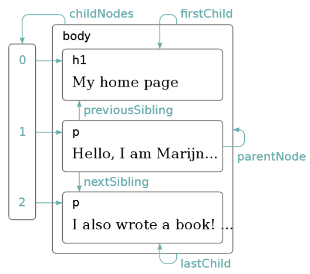

# Assignment 6 - JS Fetch 🐕

- 💯**Worth**: 25%
- 📅**Due**: December 15, 2020 @ 23:59
- 🙅🏽‍**Penalty**: Late submissions lose 10% per day to a maximum of 3 days. Nothing is accepted after 3 days and a grade of 0% will be given.

## 🎯 Objectives

- Consume your Reddit API using JS `fetch`.
- Populate the DOM using the JSON data retrieved from your API.

## 📥 Submission

Since we'll be using [Git](https://git-scm.com/) and [GitHub Classroom](https://classroom.github.com/) for this assignment, all you need to do to submit is to commit and push your code to the repository. Over the course of working on the assignment, you should be committing and pushing as you go. I will simply grade the last commit that was made before the assignment deadline.

1. `git status` to see everything that has changed since your last commit.
2. `git add .` to stage all the changed files. Instead of `.`, you can also specify one file or folder.
3. `git status` to make sure all the staged files are the ones you wanted.
4. `git commit -m "Your commit message here."`
5. `git push`
6. `git status` to make sure everything is good.

### 💯 Grade Distribution

- `PostVoteBrowserTest` = **25%**
- `CommentVoteBrowserTest` = **25%**
- `PostBookmarkBrowserTest` = **15%**
- `CommentBookmarkBrowserTest` = **15%**
- `PostBrowserTest::testManyPostsWereCreatedSuccessfully` = **10%**
- `CommentBrowserTest::testManyCommentsWereCreatedSuccessfully` = **10%**
- Breaking any of the tests not listed above = **-0.5%** for every broken test.

## 🔨 Setup

1. Attach VSCode to the PHP container. Make sure that inside the container, you're currently in `/var/www/html/Assignments`.
2. Follow the instructions from A1 to clone the repo if you're not sure how.
3. You should now have a folder inside `Assignments` called `assignment-6-githubusername`.
4. Change the `PUBLIC_PATH` in `src/Helpers/Url.php` so that it reflects your folder structure and has your GitHub username in the path.
5. Create the folders: `src/Controllers`, `src/Models`, and `src/Views`.
6. Copy all of the controllers from your A5 into `src/Controllers`.
7. Copy all of the models from your A5 into `src/Models`.
8. Copy all of the views from your A5 into `src/Views`.
9. Update all the namespaces in all the files you copied over to `AssignmentSix`.

## 🖋️ Description

In **A1**, we created the 4 main models (`User`, `Category`, `Post`, and `Comment`) that are in charge of talking to the database. The models are based on the entities from the ERD which can be found in the A1 specs.

In **A2**, we implemented the `Router` that handles the web requests/responses and instantiates a `Controller`. We also implemented the `Controller` which takes care of deciding which model method to call.

In **A3**, we implemented the **error-handling** aspect of our application by **throwing and catching exceptions**. If the `Model` threw an `Exception`, it was to be caught by the `Controller`, and thrown up to the `Router`. The `Router` then populated the `Response` message using the error from the `Exception`.

In **A4**, we implemented the **views** of our application using the [Plates PHP templating engine](https://platesphp.com/v3).

In **A5**, we implemented **session management** to allow users to log into our application.

In this **final assignment**, we will implement the functionality to:

- Up/downvote posts/comments
- Bookmark/unbookmark posts/comments
- View all the user's activity on their profile page and see the posts/comments they've written, voted on, and bookmarked.

We'll be implementing these features by getting both PHP and JS to talk to each other. The JS we'll have to write for this assignment will largely be used for calling the `fetch()` function that will make an asynchronous HTTP request to our PHP backend. If you were with me in the _Multimedia and Internet_ course a year ago, dig up your SpaceX assignment where we did exactly this. Instead of querying the SpaceX API, we're now going to query the API we've been building in this course!

We're also going to be using the `post_vote`, `comment_vote`, `bookmarked_post`, and `bookmarked_comment` database tables to implement these features. These tables are **already in your database** so you don't need to add them.

All 4 of these tables are _associative entities_:

1. `post_vote`: Resolves a many-to-many relationship between `user` and `post`.
2. `comment_vote`: Resolves a many-to-many relationship between `user` and `comment`.
3. `post_bookmark`: Resolves a many-to-many relationship between `user` and `post`.
4. `comment_bookmark`: Resolves a many-to-many relationship between `user` and `comment`.

If you need a refresher on these types of relationships, please refer to your notes and exercises from last semester in DBII.

## 📝 Prerequisites

There are **three main topics** you need to (re)familiarize yourself with from last year:

1. The **D**ocument **O**bject **M**odel
2. JS Events
3. JS Fetch

### 1. 🌳 DOM

You may have noticed that the HTML we've been writing so far:

```html
<html>
    <head>
        <title>Vik's Website</title>
    </head>
    <body>
        <h1>Home Page</h1>
        <p>Hi, my name is Vik and I teach at
            <a href="https://johnabbott.qc.ca">John Abbott College</a>.
        </p>
    </body>
</html>
```

kind of resembles a file structure:

```text
HTML
└───head <── Element Nodes
│   └───title <────┘
│       └───Vik's Website <── Text Node
└───body
    ├───h1
    │   └───Home Page
    └───p
        ├───Hi, my name is Vik and I teach at
        ├───a
        │   └───John Abbott College
        └───.
```

This is a closer representation of how the browser actually views HTML files. With this representation, each `node` of our tree has a number of properties associated with it:



With these properties, traversing the DOM tree becomes very simple. JavaScript provides helpful methods to traverse this tree.

#### DOM Traversal

There are four main ways we can get a DOM element with JavaScript:

```javascript
// <input name="user-name" class="user-class" id="user-id"/>

let userInput = document.getElementsByTagName('input')[0];
let userName = document.getElementsByName('user-name')[0];
let userClass = document.getElementsByClassName('user-class')[0];
let userId = document.getElementById('user-id');
let userQuerySelect = document.querySelector('#user-id');

// The value of every variable is: <input name="user-name" class="user-class" id="user-id"/>
```

#### DOM Manipulation

With JavaScript, we can add and remove nodes from the DOM tree:

```javascript
// Add
let node = document.createElement('h1');
let text = document.createTextNode('Hello World!');

node.appendChild(text);
document.body.appendChild(node);

// Remove
node.remove();
```

### 2. 🖱️ JS Events

Events can be thought of as code that runs automatically when "something happens", like a button-click or key-press.

#### Event Handlers

The browser will actively notify our JS code when an event occurs. Browsers do this by allowing us to register functions as handlers for specific events:

```javascript
window.addEventListener("click", () => {
    console.log("You knocked?");
});
```

The `window` binding refers to a built-in object provided by the browser. It represents the browser window that contains the `document` object that we just saw. Calling its `addEventListener` method registers the second argument (a callback function) to be called whenever the event described by its first argument occurs. In this case, the string `"You knocked?"` will print in the console every time the user clicks inside the browser window.

#### Events and DOM Nodes

We can call `addEventListener` on any DOM node, not just the `window`. The listener will only register events that happen within the scope, or context, of that DOM node.

```javascript
let button = document.querySelector("button");

button.addEventListener("click", () => {
    console.log("Button clicked.");
});
```

This will attach a click handler to the button node. Whenever the button is clicked, `"Button clicked."` will be logged to the console.

### 3. 🐕 JS Fetch

Create a file called `Assignments/assignment-6-githubusername/public/js/main.js` and write the following code inside:

```javascript
const BASE_URI = "http://" + window.location.hostname + "/Assignments/assignment-6-githubusername/public/";
let url = BASE_URI + "user/1";
const options = {
    headers: {
        // This is how the server will know to initialize a JsonResponse object and not an HtmlResponse.
        Accept: "application/json"
    }
};

fetch(url, options)
    .then(response => response.json())
    .then(data => {
        doStuff(data);
    })
    .catch(function(error) {
        // If there is any error you will catch them here.
        console.error(error);
    });

function doStuff(data) {
    // If the request was successful then data will have everything you asked for.
    console.log(data);
}
```

Make sure to include this file in your `src/Views/Partials/Header.php`:

```html
<head>
    <script src="<?= \Url::scripts('main.js') ?>" defer></script>
</head>
```

Navigate to any page on your site and open the developer tools. You should see that a JSON object was logged to the console, assuming you had a user in your database with an ID of 1. You can now do anything you want with this data! Put it in a variable, log it, populate DOM nodes with it, etc.

## 🗺️ Routes

Notice a "new" type of response listed in the routes table: `JSON`. I say "new" in quotations because it's actually not-so-new. Our app has been returning JSON this whole time in the router tests - we just haven't used it in the frontend yet. Now we have three response options: we can either render a template file, redirect the user to another page, or send back JSON.

For all the routes that return `JSON` in the table below, you'll have to make use of the JS `fetch()` function to call that route from your frontend. If you need a refresher on this, please go back to your _Multimedia and Internet_ assignment where you consumed the SpaceX API.

| Request Method | Query String                  | Action                                | Response Type           | Description                                          |
| -------------- | ----------------------------- | ------------------------------------- | ----------------------- | ---------------------------------------------------- |
| `GET`          | `/`                           | `HomeController::home`                | `HomeView.php`          | Display the homepage.                                |
| `ANY`          | `/{garbage}`                  | `ErrorController::error`              | `ErrorView.php`         | Display a 404 error page.                            |
| `GET`          | `/auth/register`              | `AuthController::getRegisterForm`     | `User/NewFormView.php`  | Display a form to register a new user.               |
| `GET`          | `/auth/login`                 | `AuthController::getLoginForm`        | `LoginFormView.php`     | Display a form to log in a user.                     |
| `POST`         | `/auth/login`                 | `AuthController::logIn`               | `/user/{id}`            | Log in a user.                                       |
| `GET`          | `/auth/logout`                | `AuthController::logOut`              | `/`                     | Log out the user.                                    |
| `POST`         | `/user`                       | `UserController::new`                 | `/auth/login`           | Register a user.                                     |
| `GET`          | `/user/{id}`                  | `UserController::show`                | `User/ShowView.php`     | Display a user's profile where they can edit/delete. |
| `GET`          | `/user/{id}/posts`            | `UserController::getPosts`            | `JSON`                  | Display all posts for this user.                     |
| `GET`          | `/user/{id}/comments`         | `UserController::getComments`         | `JSON`                  | Display all comments for this user.                  |
| `GET`          | `/user/{id}/postvotes`        | `UserController::getPostVotes`        | `JSON`                  | Display all posts this user has voted on.            |
| `GET`          | `/user/{id}/commentvotes`     | `UserController::getCommentVotes`     | `JSON`                  | Display all comments this user has voted on.         |
| `GET`          | `/user/{id}/postbookmarks`    | `UserController::getPostBookmarks`    | `JSON`                  | Display all post bookmarks for this user.            |
| `GET`          | `/user/{id}/commentbookmarks` | `UserController::getCommentBookmarks` | `JSON`                  | Display all comment bookmarks for this user.         |
| `PUT`          | `/user/{id}`                  | `UserController::edit`                | `/user/{id}`            | Edit a user's profile.                               |
| `DELETE`       | `/user/{id}`                  | `UserController::destroy`             | `/user/{id}`            | Deactivate a user's profile.                         |
| `POST`         | `/category`                   | `CategoryController::new`             | `/`                     | Create a new category.                               |
| `GET`          | `/category/{id}`              | `CategoryController::show`            | `Category/ShowView.php` | Display all posts in a category.                     |
| `GET`          | `/category/{id}/edit`         | `CategoryController::getEditForm`     | `Category/EditView.php` | Display a form to edit a category.                   |
| `PUT`          | `/category/{id}`              | `CategoryController::edit`            | `/category/{id}`        | Edit category title/description.                     |
| `DELETE`       | `/category/{id}`              | `CategoryController::destroy`         | `/`                     | Deactivate a category.                               |
| `POST`         | `/post`                       | `PostController::new`                 | `/category/{id}`        | Create new post.                                     |
| `GET`          | `/post/{id}`                  | `PostController::show`                | `Post/ShowView.php`     | Display a post's details and comments.               |
| `GET`          | `/post/{id}/upvote`           | `PostController::upVote`              | `JSON`                  | Upvote a post.                                       |
| `GET`          | `/post/{id}/downvote`         | `PostController::downVote`            | `JSON`                  | Downvote a post.                                     |
| `GET`          | `/post/{id}/bookmark`         | `PostController::bookmark`            | `JSON`                  | Bookmark a post.                                     |
| `GET`          | `/post/{id}/unbookmark`       | `PostController::unbookmark`          | `JSON`                  | Unbookmark a post.                                   |
| `GET`          | `/post/{id}/edit`             | `PostController::getEditForm`         | `Post/EditView.php`     | Display a form to edit a post.                       |
| `PUT`          | `/post/{id}`                  | `PostController::edit`                | `/post/{id}`            | Edit contents of text post.                          |
| `DELETE`       | `/post/{id}`                  | `PostController::destroy`             | `/post/{id}`            | Deactivate a post.                                   |
| `POST`         | `/comment`                    | `CommentController::new`              | `/post/{id}`            | Create a new comment.                                |
| `GET`          | `/comment/{id}`               | `CommentController::show`             | `Comment/ShowView.php`  | Display a comment along with its replies.            |
| `GET`          | `/comment/{id}/upvote`        | `CommentController::upVote`           | `JSON`                  | Upvote a comment.                                    |
| `GET`          | `/comment/{id}/downvote`      | `CommentController::downVote`         | `JSON`                  | Downvote a comment.                                  |
| `GET`          | `/comment/{id}/bookmark`      | `CommentController::bookmark`         | `JSON`                  | Bookmark a comment.                                  |
| `GET`          | `/comment/{id}/unbookmark`    | `CommentController::unbookmark`       | `JSON`                  | Unbookmark a comment.                                |
| `GET`          | `/comment/{id}/edit`          | `CommentController::getEditForm`      | `Comment/EditView.php`  | Display a form to edit a comment.                    |
| `PUT`          | `/comment/{id}`               | `CommentController::edit`             | `/post/{id}`            | Edit the contents of a comment.                      |
| `DELETE`       | `/comment/{id}`               | `CommentController::destroy`          | `/post/{id}`            | Deactivate a comment.                                |

## 🧪 Tests

As usual, get all your model functions working first since that's the base of the whole application. Then make sure the controllers can call the model methods successfully. Move on to the router tests to verify that the proper JSON is being returned from the app. Finish with the browser tests by implementing all of the UI interactions. I highly recommend working on them in (loosely) this order:

- `ModelTests`
  - `PostVoteTest`
  - `CommentVoteTest`
  - `PostBookmarkTest`
  - `CommentBookmarkTest`
- `ControllerTests`
  - `PostVoteControllerTest`
  - `CommentVoteControllerTest`
  - `PostBookmarkControllerTest`
  - `CommentBookmarkControllerTest`
- `RouterTests`
  - `PostVoteRouterTest`
  - `CommentVoteRouterTest`
  - `PostBookmarkRouterTest`
  - `CommentBookmarkRouterTest`
- `BrowserTests`
  - `PostVoteBrowserTest`
  - `CommentVoteBrowserTest`
  - `PostBookmarkBrowserTest`
  - `CommentBookmarkBrowserTest`
  - `PostBrowserTest::testManyPostsWereCreatedSuccessfully`
  - `CommentBrowserTest::testManyCommentsWereCreatedSuccessfully`

### 🎥 [Test Suite Video](https://youtu.be/MddDGP3jnIY)

The test code itself serves as a guide for you to create your views as they will tell you what elements on the page it expects. To aid you further, I've recorded a slowed down run of all the browser tests which can be found [here](https://youtu.be/MddDGP3jnIY). This will enable you to see my interpretation of the pages, and how they look and function. Use this video! Don't be left in the [dark 🌚](https://youtu.be/v7qQuqy6NfY)!
